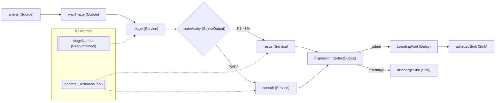

# simulation-build-plan

Turns a confirmed Phase 0 outcome (approach + intake summary) into a **buildable plan**:
the user should be able to open AnyLogic next to the plan and follow it step by step,
verifying as they go. Never generate this before Phase 0 is confirmed — if the approach
isn't settled, go back (`simulation-welcome` → Phase 0).

Idioms live in the companion skills — reference them, don't restate them:
`anylogic-des` / `anylogic-abm` / `anylogic-sd` for construction, `anylogic-2d`/`-3d`
for animation, `anylogic-debug` when a step's verify fails.

## The plan document (always this structure)

### 1. Model summary (5 lines)
Approach + why (one sentence from Phase 0) · entities · resources · KPIs · run length
and replication plan (Reps experiment, N=30, from day one — single runs lie).

### 2. Preview flow diagram (Mermaid — BEFORE any build step)
Draw the full process flow as a Mermaid flowchart so the user sees the shape of the
model before touching the canvas. Conventions:

- `flowchart LR` — same left-to-right direction as the canvas will use.
- Node label = **the exact AnyLogic block name** the plan will create, plus the block
  type: `triage["triage (Service)"]`.
- Label every SelectOutput edge with its routing condition/probability.
- Wrap sub-processes in `subgraph` blocks — they become hierarchy or visual grouping
  on the canvas.
- List ResourcePools in their own subgraph, connected by dotted lines to the blocks
  that seize them.

Example shape:



Ask the user to confirm the diagram matches their mental picture — **cheapest possible
moment to fix a wrong flow.**

### 3. Canvas layout map (where everything goes)
Give explicit placement so the canvas stays readable as it grows. Default layout
(adapt to the model):

```
┌────────────────────────────────────────────────────────────────┐
│ TOP-LEFT: parameters, variables,      TOP-RIGHT: KPI outputs,  │
│ data files, functions, schedules      statistics, datasets     │
│                                                                │
│ MIDDLE BAND (y≈0): the main flow, LEFT → RIGHT, one line       │
│   Source … Queues/Services/SelectOutputs … Sinks (far right)   │
│   Branches fan out BELOW the main line, rejoining where needed │
│                                                                │
│ BELOW FLOW: ResourcePools in a row, each under the block(s)    │
│   that seize it; agent populations grouped in labelled frames  │
│                                                                │
│ BOTTOM / separate view: charts, dashboards, animation frame    │
└────────────────────────────────────────────────────────────────┘
```

Rules: main flow on one horizontal line wherever possible; consistent spacing;
sub-flows either in a hierarchy block or a clearly framed region below; nothing
overlapping the animation markup. For 2D/3D animation placement, defer to
`anylogic-2d` / `anylogic-3d`.

### 4. Numbered build steps (the core)
Small steps, ordered so the model RUNS at every checkpoint (flow before detail —
toy rates first, data and statistics later). Each step in this exact format:

> **Step N — <goal in one line>**
> - **Palette → block:** which palette, which block, drag where (per the layout map)
> - **Name:** exact camelCase name (matches the diagram)
> - **Properties:** only the fields to change, with exact values/expressions
> - **Code:** any Java (On enter / On exit / functions), in a fenced block
> - **Verify:** the specific check before moving on — "Run: agents traverse to
>   dischargeSink; count > 0" — never just "it compiles"

Order template: (1) model time units + run window → (2) skeleton flow with toy
rates → (3) run end-to-end → (4) real arrival data → (5) resources + seize/release →
(6) routing logic (set upstream — see anylogic-des) → (7) service-time distributions →
(8) priorities → (9) per-step KPIs → (10) Reps experiment (N=30, CIs) → (11) animation.

### 5. Instrumentation & experiment
TimeMeasure pairs for every KPI interval; datasets/outputs wired to the experiment;
the Reps experiment configured (Parameter Variation, Freeform, N=30, fixed-seed OFF)
with parameters set IN THE EXPERIMENT (they override Main — classic trap, see
anylogic-debug). State the CI convention (Student-t).

### 6. Sanity checks before trusting any number
- Toy-rate traversal test passed at every checkpoint.
- Little's Law / utilisation cross-check on at least one station.
- Across replications: each statistic has N samples, min ≠ max.
- Every cited result = mean over replications with a CI — never a single run.

## Rules

- The diagram (§2) and layout map (§3) come BEFORE the steps — shape first, clicks second.
- Every block name appears identically in diagram, layout, and steps.
- Steps must be verifiable in isolation; if a verify fails, route to `anylogic-debug`.
- Deliver the whole plan as one document the user can save (offer to write it to a
  file, e.g. `BUILD-PLAN-<model>.md`).
